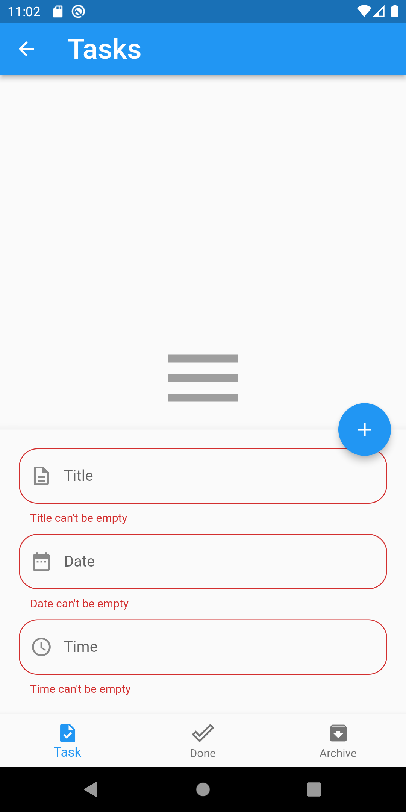
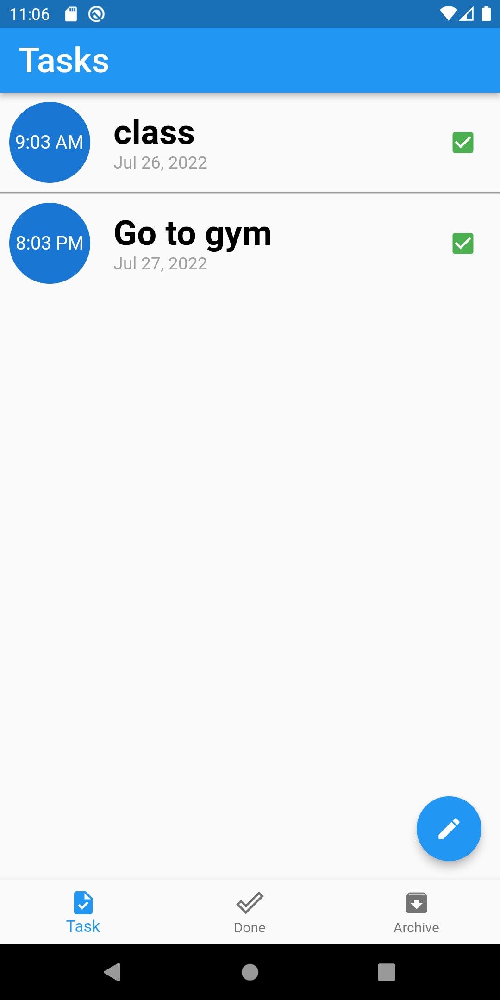
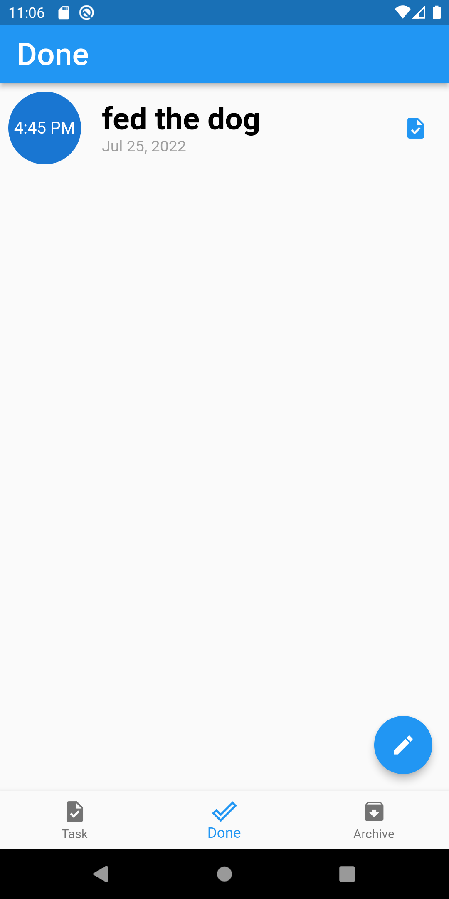
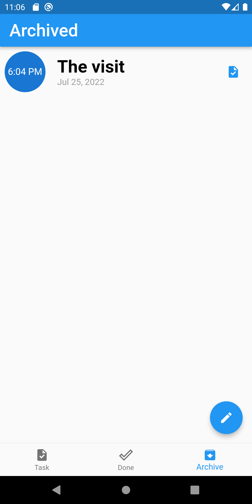

# to_do_app

A To-Do Flutter application to manage your TaskList using Bloc architecture.

## Flutter Version
Flutter 3.0.4 

## Snapsots
   

## Application Features
* Create New Tasks from the Action button.
* Locally store created Tasks using database file.
* Fetch and Display new and done Tasks from the locale db file.
* Update and Delete feature from the local db file.
* Move tasks to the done section by a button.
* swiping tasks send it to the archive.
* delete tasks by swiping it from the archive.

  
## plugins used
- [cupertino_icons](https://pub.dev/packages/cupertino_icons): ^1.0.2
- [sqflite](https://pub.dev/packages/sqflite): ^2.0.3
- [intl](https://pub.dev/packages/intl) : ^0.17.0 # for date_format
- [conditional_builder_null_safety](https://pub.dev/packages/conditional_builder_null_safety): ^0.0.6
- [bloc](https://pub.dev/packages/bloc): ^8.0.3
- [flutter_bloc](https://pub.dev/packages/flutter_bloc): ^8.0.1

---
## Note about the source code

This app was created while learning Flutter , Suggestions and Improvements are most Welcomed! :)
